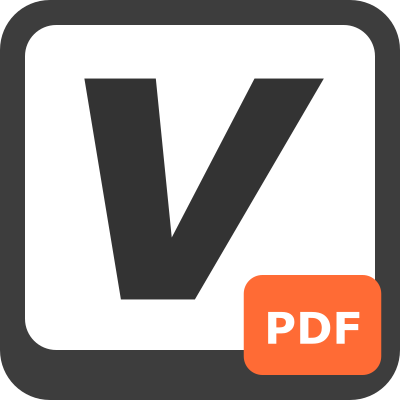
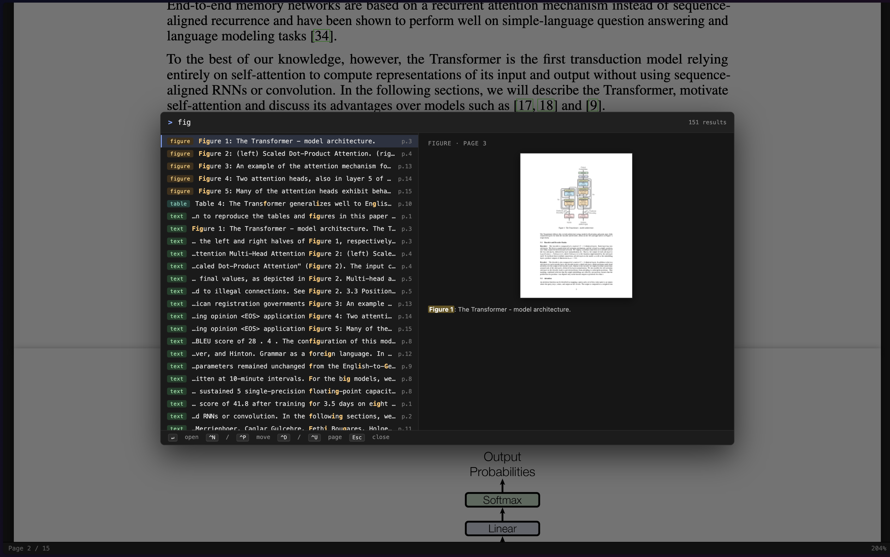
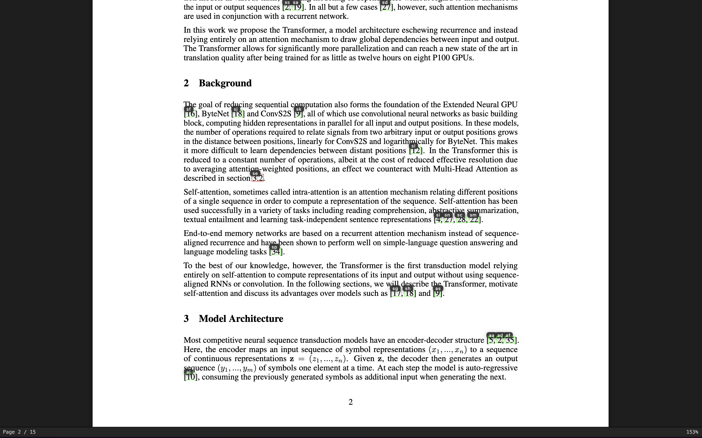
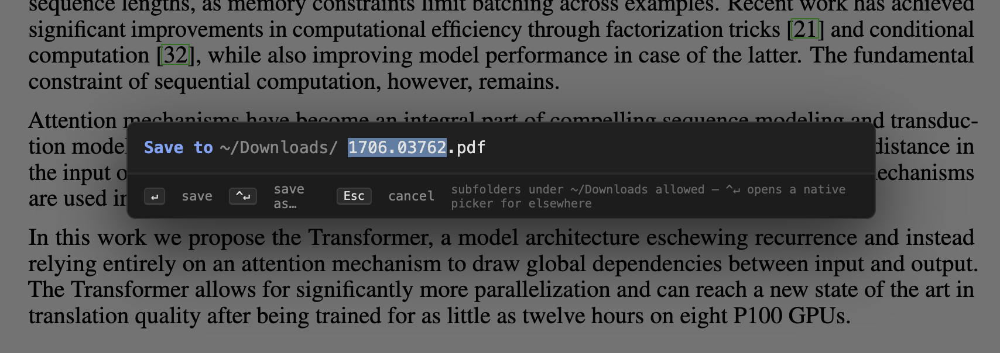

<p align="center">
  
</p>

<h1 align="center">VimDF: Vim for PDFs</h1>

<p align="center">
  <strong>Vim keybindings for PDF viewing in Chrome</strong><br>
  Scroll, jump, search, select and highlight — all without leaving the home row.
</p>

<p align="center">
  <a href="https://chromewebstore.google.com/detail/vimdf/ljjchallgifapclnhgoilmlijmncbahn">
    
  </a>
  <a href="https://developer.chrome.com/docs/extensions/mv3/intro/">
    
  </a>
  <a href="https://www.typescriptlang.org/">
    
  </a>
  <a href="https://mozilla.github.io/pdf.js/">
    
  </a>
  <a href="LICENSE">
    
  </a>
</p>

## 📖 About

VimDF replaces Chrome's built-in PDF viewer with a modal, keyboard-driven one. It renders PDFs with [PDF.js](https://mozilla.github.io/pdf.js/) and wraps them in a Vim-style input layer — so reading a paper, thesis, or spec feels like editing in Vim: motions, marks, jump list, visual selection, hints, and all.

## ✨ Features

- **Vim-style navigation** — `j`/`k`/`h`/`l`, `gg`/`G`/`{n}G`, `Ctrl-d`/`Ctrl-u`/`Ctrl-f`/`Ctrl-b`
- **Tab navigation** (Vimium-compatible) — `J`/`K` previous/next tab, `g0`/`g$` first/last, `t` new tab, `x` close. Fills the gap left by Vimium not being able to bind keys on Chrome's PDF viewer
- **Search** — `/` to query, `n`/`N` to cycle matches
- **Fuzzy finder** (`T`) — Telescope-style picker across outline, figure/table captions, marks, highlights, and full text. Live preview with page thumbnail and highlighted snippet

  <p align="center">
    
  </p>

- **Marks** — `m{a-z}` to set, `'{a-z}` to jump back
- **Link hints** — `f` shows two-letter hint labels on every link in view, `F` opens in a new tab. After following a citation / internal link, `Ctrl-O` jumps back and `Ctrl-I` / `Tab` jumps forward through the history

  <p align="center">
    
  </p>
- **Jump list** — `Ctrl-O` / `Ctrl-I` / `Tab` to traverse your jump history (like Vim's `''` stack)
- **Outline sidebar** — `o` toggles table of contents, auto-focuses the section you're currently reading; `j`/`k` moves selection, `Enter` jumps
- **Caret mode** — `i` enters a Vim-modal caret over the text layer:
  - `h`/`l`/`w`/`b`/`e` for char/word motion
  - `j`/`k` column-aware line motion, `Ctrl-h`/`Ctrl-l` for column jumps
  - `0`/`$` line ends, `zz`/`zt`/`zb` caret-recentering
  - `v` / `V` / `Ctrl-V` for char / line / block VISUAL modes
  - `y` yank to clipboard, `H` save selection as persistent highlight
- **Download / Print** — `Ctrl-S` opens a finder-styled save dialog (defaults to `~/Downloads/`, remembers your last subfolder, `Ctrl-↵` for a native "Save as…" picker). `Ctrl-P` prints with page sizes matched to the PDF

  <p align="center">
    
  </p>

- **Publisher shims** — auto-redirects Science / OpenReview / ACM / arXiv viewer pages to the raw PDF so you stay in VimDF
- **Remembers last page** per document (toggleable)
- **Theming** — Auto/Dark/Light; customizable hint & status-bar colors
- **Keymap aliases** — bind your own keys to half/full-page scroll commands
- **Scrollable & searchable help** — `?` opens the keybinding reference; `j`/`k` to scroll, `/` to filter live

Press `?` inside the viewer for the full keybinding reference.

## 🚀 Installation

### From the Chrome Web Store

Install from the [**Chrome Web Store**](https://chromewebstore.google.com/detail/vimdf/ljjchallgifapclnhgoilmlijmncbahn).

To open `file://` PDFs directly, visit `chrome://extensions`, find **VimDF**, click **Details**, and toggle **Allow access to file URLs**.

### From source (developer mode)

```bash
git clone https://github.com/tatsukamijo/vimdf.git
cd vimdf
npm install
npm run build
```

Then in Chrome:

1. Open `chrome://extensions`
2. Enable **Developer mode** (top-right toggle)
3. Click **Load unpacked** and select the `dist/` folder
4. To open `file://` PDFs directly, click **Details** → toggle **Allow access to file URLs**

## 💡 Usage

Once installed, any PDF you open — over `http(s)` or `file://` (with file access allowed) — is automatically handled by VimDF. It catches PDFs whether they open as their own tab or are embedded in a page's `<iframe>` (e.g. a live-preview server), and whether or not the URL ends in `.pdf` (it also inspects the response `Content-Type`). Press `?` to see all keybindings.

Settings live in the extension's Options page (right-click the toolbar icon → Options). Theme, scroll steps, zoom step, page-scroll aliases, link-hint colors, status-bar colors, and per-document last-page persistence are all configurable and sync across Chrome profiles.

## 🛠 Development

```bash
npm run dev        # Vite dev server with HMR
npm run build      # production bundle in dist/
npm run typecheck  # tsc --noEmit
```

The codebase is roughly:

```
src/
├── background/service-worker.ts   # DNR rule to intercept PDF navigations
├── common/settings.ts             # chrome.storage.sync schema + migrations
├── options/                       # options page (HTML/CSS/TS)
└── viewer/                        # the viewer itself
    ├── viewer.ts                  # PDF.js integration, state persistence
    ├── vim-controller.ts          # root keydown dispatcher
    ├── caret-mode.ts              # modal text-caret navigation & selection
    ├── finder.ts                  # Telescope-style fuzzy finder (T)
    ├── hints.ts                   # link-hint overlay
    ├── outline.ts                 # sidebar TOC
    ├── search.ts                  # / search controller (PDF.js find)
    ├── marks.ts                   # per-doc mark persistence
    ├── highlights.ts              # user-saved highlights layer
    ├── print.ts                   # rasterised print + PDF download
    ├── save-dialog.ts             # modal filename picker for Ctrl-S
    └── continuous-scroll.ts       # rAF-driven smooth scroll for held keys
```

## 🔧 Tech

- [PDF.js](https://github.com/mozilla/pdf.js) for rendering
- [@crxjs/vite-plugin](https://crxjs.dev/vite-plugin/) for MV3 bundling
- TypeScript, Vite, Chrome Extension Manifest V3

## 👤 Author

Tatsuya Kamijo — <tatsukamijo@icloud.com>

## 📝 License

[MIT](LICENSE)
